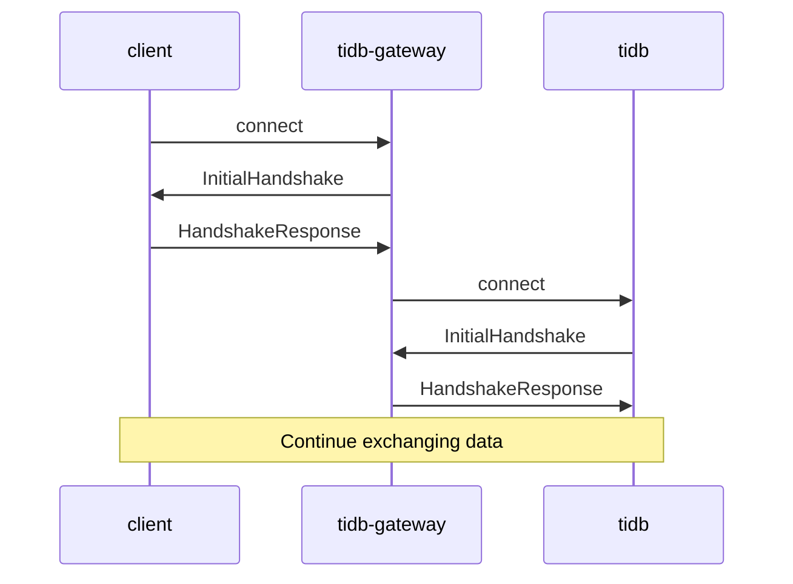

# tidb-gateway

Manage client connections to multiple TiDB instances.

mysql 客户端可以通过 gateway 连接不同的后端 TiDB 集群。

## How

为了兼容尽可能多的 driver，我们修改了 DBName 字段（即 mysql 的 -D 参数）来指定后端集群。

规则如下：

|||
|---|---|
|-D 12345.test|cluster-id=12345, db=test|
|-D 12345|cluster-id=12345, db=|
|-D test|cluster-id=test, db=|
|不提供|不合法|



## Example

```bash
# start tidb1 (localhost:4000)
> ./tidb-server
# start tidb2 (localhost:4001)
> ./tidb-server -P 4001 -status 10081 -path /tmp/tidb2

# start tidb-gateway (localhost:3306)
> ./tidb-gateway --addr :3306 --backend tidb1=localhost:4000 --backend tidb2=localhost:4001

# connect tidb1
> mysql -uroot -h 127.0.0.1 -Dtidb1

# connect tidb2 (database=test)
> mysql -uroot -h 127.0.0.1 -Dtidb2.test
```
